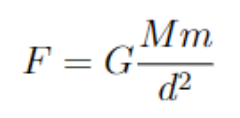
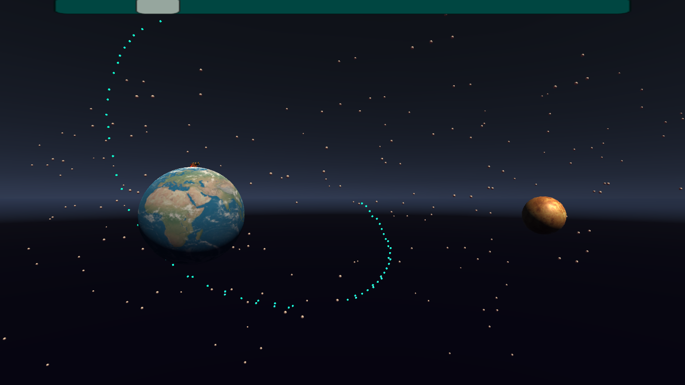

## Objetivo
Analisar, por meio da associação da física e da computação, a atuação da mecânica de corpos em órbita com a terra pensada no experimento mental do canhão de Newton, através de uma simulação feita no motor gráfico Unity, usado na criação de jogos.

## Fundamento Teórico
O canhão de Newton é um experimento mental idealizado pelo físico para a confirmação de sua lei da gravitação universal [1]. Tal lei de Newton defende que:

De modo que G é caracterizado como a constante de gravitação universal com valor $G \approx 6,67 \times 10^{-11} \frac{Nm^2}{kg^2}$, M e m são as massas de dois corpos diferentes analisados e d a distância entre o centro de massa dos corpos.

Neste experimento, Newton defende que de acordo com a velocidade inicial de lançamento de um objeto a partir de um canhão posicionado na terra, o objeto entraria ou não em órbita com a terra, de maneira semelhante à forma na qual a lua orbita a terra. Caso a velocidade não seja suficiente, o objeto cairia na terra e caso a velocidade seja superior à necessária para a órbita, a velocidade de escape seria alcançada e o objeto seguiria para fora da terra sem orbitar.

## Metodologia
Para a compreensão do experimento, inicialmente é essencial que entendamos os itens usados na simulação:

Em primeiro plano, no âmbito dos softwares, a linguagem de programação usada para os cálculos e demais tarefas foi o C\#, que é multi-paradigma, logo, pode ser usada tanto de maneira estrutural imperativa, como orientada a objetos. Neste experimento, tal linguagem será usada de acordo com o paradigma orientado a objetos.

Tal linguagem de programação supracitada, será usada na interface de desenvolvimento Visual Studio Code, um software gratuito que auxilia no desenvolvimento e programação.

Por fim, cabe ressaltar o motor gráfico denominado Unity utilizado na construção da simulação, responsável tanto pela compilação do código escrito em C\#, etapa em que o código é convertido em linguagem de máquina, quanto pela disponibilização de modelos 3D gratuitos e livres para uso.

Para a realização do experimento mental de Newton, um jogo será implementado, de forma que o usuário controle um canhão parado sobre o planeta terra e a intensidade da velocidade inicial exercida sobre uma bola a ser lançada. Dessa forma, o objetivo do jogo é o usuário atingir a correta velocidade inicial do projétil, de modo que este entre em órbita com a terra.

## Resultados e Análises
A partir da definição do cálculo da força gravitacional que age nos dois objetos (Terra e projétil), obtivemos a simulação:

Cabe ressaltar que para que os projéteis, de fato, orbitem na Terra, a aceleração centrípeta deve ser perpendicular à velocidade. Já em relação à velocidade de escape, necessária para que o projétil lançado não caia nem entre em órbita, mas vá em direção ao infinito.

Visto que o objeto tende ao infinito, a força de atração entre os dois corpos deveria ser 0 e para isso, necessitaríamos de uma distância infinita, o que para as limitações computacionais é inviável. Portanto, no programa, definimos um determinado valor que se comporta como suficiente para o escape.
